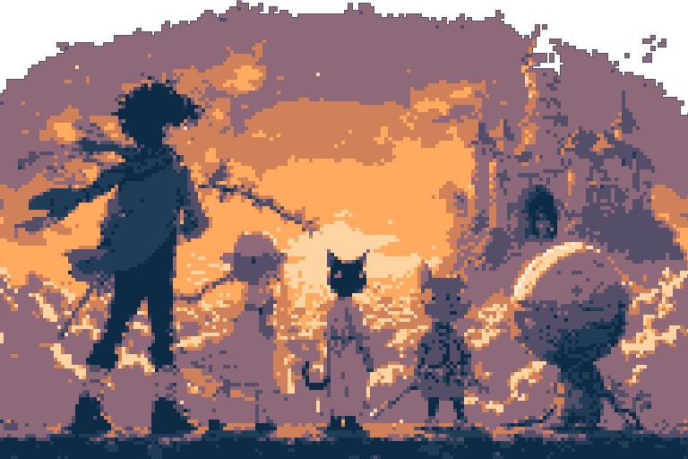

# 🎮 ED - Acima das Nuvens

> **RPG interativo baseado em cartas e narrativa ramificada** - Aventura sobre as nuvens onde cada decisão molda o destino de 5 personagens únicos em busca da lendária Gansa dos Ovos Dourados.

## 🎯 Conceito Principal

**Sistema Híbrido: Cartas + Narrativa em Árvore**

Inspirado em [Night of the Full Moon](https://play.google.com/store/apps/details?id=com.ztgame.yyzy) e [Zork](https://textadventures.co.uk/games/play/5zyoqrsugeopel3ffhz_vq):

- 🃏 **Combates baseados em cartas** (CSS flip cards)
- 🌳 **Narrativa ramificada** em estrutura de árvore
- 🎭 **5 personagens jogáveis** com objetivos únicos
- 🏰 **Cenário**: Castelo nas nuvens do Gigante

## 🏗️ Stack Tecnológica

```javascript
Frontend: HTML5 + CSS/Sass + Brython
Build:    Vite + Sass compiler  
Runtime:  Bun
```

### Estrutura do Projeto

```
ed-acima_das_nuvens/
├── src/
│   ├── index.html              # Interface principal
│   ├── main.py                 # Lógica Brython
│   └── style.css               # Estilos
├── lib/
│   ├── brython/                # Runtime Brython
│   └── materialize/            # Framework CSS
└── package.json                # Scripts e dependências
```

## 🎭 Personagens & Objetivos

| Personagem  | Objetivo Principal     | Motivação             |
| ----------- | ---------------------- | --------------------- |
| **João** 👦🏻  | Matar o Gigante 🧌      | Vingança pela família |
| **Maria** 👧🏻 | Conquistar o Castelo 🏰 | Sede de poder         |
| **Pib** 🐈   | Devorar a Gansa 🪿      | Fome ancestral        |
| **Kit** 🐈‍⬛  | Acumular riquezas 💰    | Ganância              |
| **Ed** 🥚    | Encontrar família 👥    | Abandono              |

**Objetivo Comum: Roubar a Gansa 🪿 dos Ovos Dourados**

## 🚀 Desenvolvimento

```bash
# Ambiente de desenvolvimento
bun run dev                   # Vite dev server + hot reload

# Build e preview
bun run build                 # Build de produção
bun run preview              # Preview do build
```

## 🎯 Roadmap

### **Fase 1: Fundação** *(Atual)*
- [x] Estrutura básica HTML/CSS/Python
- [x] Integração Brython
- [x] Sistema de build Vite
- [ ] Framework CSS (Materialize)

### **Fase 2: Cartas CSS**
- [ ] Implementar flip cards CSS
- [ ] Sistema de deck por personagem
- [ ] Animações de combate

### **Fase 3: Narrativa**
- [ ] Árvore de decisões (JSON)
- [ ] Sistema de flags de progresso
- [ ] Múltiplos finais

## 📄 Licença

**AGPL-3.0-only** - Veja [LICENSE](LICENSE) para detalhes.
  perspective: 1000px;
  
  &.flipped .card-inner {
    transform: rotateY(180deg);
  }
  
  .card-front, .card-back {
    backface-visibility: hidden;
  }
}
```

## 🚀 Comandos de Desenvolvimento

### **Desenvolvimento Principal**

```bash
# Ambiente de desenvolvimento
bun run dev                   # Vite dev server + hot reload

# Build e preview
bun run build                 # Build de produção
bun run preview              # Preview do build
```

## 🎨 Referências Visuais

### **Inspirações de Gameplay**

- 🌙 [**Night of the Full Moon**](https://play.google.com/store/apps/details?id=com.ztgame.yyzy)
- 📖 [**Zork by Tim Anderson**](https://textadventures.co.uk/games/play/5zyoqrsugeopel3ffhz_vq)

### **Estética Pretendida**

- 🎨 **Arte**: ASCII/Pixel art
- 🎭 **Tom**: Dark fairy tale brasileiro
- 🃏 **UI**: Cartas com flip animations
- 🌌 **Cenário**: Castelo nas nuvens

## 🎯 Roadmap de Desenvolvimento

### **Fase 1: Fundação** *(Atual)*

- [x] Estrutura básica HTML/CSS/Python
- [x] Integração Brython
- [x] Sistema de build Vite
- [ ] Framework CSS (Materialize/Bulma)

### **Fase 2: Cartas CSS** *(Próxima)*

- [ ] Implementar flip cards CSS
- [ ] Sistema de deck por personagem
- [ ] Animações de combate
- [ ] Estados de carta

### **Fase 3: Narrativa**

- [ ] Árvore de decisões (JSON)
- [ ] Sistema de flags de progresso
- [ ] Múltiplos finais
- [ ] Save/Load de progresso

### **Fase 4: Polish**

- [ ] Arte final das cartas
- [ ] Efeitos sonoros
- [ ] Animações avançadas
- [ ] Mobile responsivo

## 🤝 Como Contribuir

1. **Fork** do repositório
2. **Clone** localmente: `git clone ...`
3. **Instalar** dependências: `bun install`
4. **Desenvolver** com: `bun run dev`
5. **Build** com: `bun run build`

---

> 💡 **Nota Técnica**: O projeto usa Brython para executar Python diretamente no browser, eliminando a necessidade de transpilação. O Vite fornece hot reload e build otimizado.

## 📄 Licença

**AGPL-3.0-only** - Veja [LICENSE](LICENSE) para detalhes.
```

### **Gerenciamento Seguro de Arquivos**

```bash
# Mover mantendo histórico Git
npm run move:safe pasta_antiga/ pasta_nova/
git mv arquivo.txt novo_nome.txt

# ⚠️ NUNCA mover manualmente - usar git mv
```

## 🎨 Referências Visuais

### **Inspirações de Gameplay**

- 🌙 [**Night of the Full Moon**](https://play.google.com/store/apps/details?id=com.ztgame.yyzy)
  - Sistema de cartas roguelike
  - Narrativa dark fairy tale
  - Arte estilizada 2D

- 📖 [**Zork by Tim Anderson**](https://textadventures.co.uk/games/play/5zyoqrsugeopel3ffhz_vq)
  - Narrativa ramificada
  - Escolhas com consequências
  - Múltiplos finais

### **Estética Pretendida**

- 🎨 **Arte**: Ascii
- 🎭 **Tom**: Dark fairy tale brasileiro
- 🃏 **UI**: Cartas com flip animations + ascii sprite
- 🌌 **Cenário**: Castelo nas nuvens + atmosfera mística

## 📊 Métricas do Projeto

### **Otimizações Implementadas**

- ✅ Build reduzido de 100MB+ para ~6MB
- ✅ Detecção automática de dependências
- ✅ Dual testing (Jest + Pytest)
- ✅ Live reload para HTML/Python/CSS
- ✅ Sass compilation automatizada

### **Cobertura de Testes**

- 🧪 **Jest**: Interface, DOM, simulação PyScript
- 🐍 **Pytest**: Lógica Python, mocks completos
- 📊 **Coverage**: Relatórios HTML + Terminal

## 🎯 Roadmap de Desenvolvimento

### **Fase 1: Fundação** *(Atual)*

- [x] Estrutura básica HTML/CSS/Python
- [x] Sistema de temas (light/dark)
- [x] Testes automatizados (Jest + Pytest)
- [x] Build system otimizado

### **Fase 2: Cartas CSS**

- [ ] Implementar flip cards CSS puros
- [ ] Sistema de deck por personagem
- [ ] Animações de combate
- [ ] Estados de carta (ativa/usada/bloqueada)

### **Fase 3: Narrativa**

- [ ] Árvore de decisões (JSON) por personagem
- [ ] Sistema de flags de progresso
- [ ] Múltiplos finais implementados
- [ ] Save/Load de progresso

### **Fase 4: Polish**

- [ ] Arte final das cartas
- [ ] Efeitos sonoros
- [ ] Animações avançadas
- [ ] Mobile responsivo

## 🤝 Como Contribuir

1. **Fork** do repositório
2. **Clone** localmente: `git clone ...`
3. **Instalar** dependências: `npm install`
4. **Desenvolver** com: `npm run dev`
5. **Testar** com: `npm test && npm run pytest`
6. **Build** otimizado: `npm run deps:build`

---

> 💡 **Nota Técnica**: O projeto usa PyScript para lógica Python client-side, substituindo implementação javascript, com a pretensão de estabelecer arquivos JSON para utilizar como banco de dados estático afim de estabelecer a progressão da narrativa. O sistema de build otimizado detecta automaticamente dependências reais, reduzindo drasticamente o tamanho dos deploys.

## 📄 Licença

**AGPL-3.0-only** - Veja [LICENSE](LICENSE) para detalhes.

---

## 🚀 Deploy & GitHub Pages

### **Deploy Automático via GitHub Actions**

O projeto possui um sistema de **deploy automático** configurado através do workflow `.github/workflows/main.yml` que:

- ✅ **Detecta dependências mínimas** via `dependencies.py`
- ✅ **Compila SASS** automaticamente
- ✅ **Gera build otimizado** (~6MB) via `minbuild.py`
- ✅ **Deploy no GitHub Pages** a cada push na `main`

### **Pipeline de Build Completo**

```yml
Push → GitHub Actions → Deps Analysis → SASS Compile → Minimal Build → Deploy Pages
  ↓         ↓                 ↓             ↓                ↓               ↓
 main  Ubuntu 22.04    dependencies.py   npm build      minbuild.py     Live Site
```

### **Monitoramento do Deploy**

#### **Status em Tempo Real**

- 🔍 **Actions**: [github.com/araujosemacento/ed-acima_das_nuvens/actions](https://github.com/araujosemacento/ed-acima_das_nuvens/actions)

- 🌐 **Site Live**: [araujosemacento.github.io/ed-acima_das_nuvens](https://araujosemacento.github.io/ed-acima_das_nuvens/)

- 📊 **Build Logs**: Disponíveis na aba Actions

#### **Triggers de Deploy**

```yaml
# Deploy automático em:
- push: branches main          # Commits diretos
- pull_request: branches main  # PRs para main
```

### **Processo de Build Otimizado**

#### **Fase 1: Análise de Dependências**

```bash
# Executado automaticamente no CI
python dependencies.py
# Detecta apenas arquivos essenciais
# Output: dependencies.json (~6MB vs 100MB+)
```

#### **Fase 2: Compilação SASS**

```bash
# Converte SASS para CSS otimizado
npm run build:sass
# Compressão automática via --style compressed
```

#### **Fase 3: Build Mínimo**

```bash
# Cria distribuição final
python minbuild.py
# Result: dist/ folder com apenas essenciais
```

### **Configuração do Workflow**

O arquivo `.github/workflows/main.yml` configura:

```yaml
# Stack completa no CI
- Python 3.11          # PyScript + build scripts
- Node.js 18           # SASS compilation  
- Ubuntu Latest        # Ambiente padronizado
```

#### **Permissões Necessárias**

```yaml
permissions:
  contents: write     # Leitura do repositório
  pages: write        # Deploy no Pages
  id-token: write     # Token de autenticação
```

### **Troubleshooting Comum**

#### **❌ Build Falha - SASS**

```powershell
# Problema: sass/index.scss não encontrado
# Solução: Verificar estrutura de pastas
ls sass/           # Deve existir
# Get-Child Item -Recurse sass/  # Comando equivalente no PowerShell
npm run build:sass # Testar localmente
```

#### **❌ Deploy Falha - Dependencies**

```powershell
# Problema: dependencies.py crash
# Solução: Executar análise local
python dependencies.py
cat dependencies.json  # Verificar output
# Get-Content dependencies.json  # Comando equivalente no PowerShell
```

#### **❌ Pages Não Atualiza**

```bash
# Problema: Cache do GitHub Pages
# Solução: Force refresh ou aguardar ~5min
# Verificar: Settings → Pages → Source: GitHub Actions
```

### **Desenvolvimento → Produção**

#### **Fluxo Recomendado**

```bash
# 1. Desenvolver localmente
npm run dev                    # Ambiente completo

# 2. Testar build local
npm run deps:scan             # Análise deps
npm run deps:build            # Build mínimo
cd dist && python -m http.server 8000  # Testar localmente

# 3. Deploy automático
git add -A
git commit -m "feat: nova funcionalidade"
git push origin main          # Trigger automático

# 4. Monitorar deploy
# Acessar: github.com/araujosemacento/ed-acima_das_nuvens/actions
# Aguardar: ~2-5 minutos para build completo
```

### **Otimizações de Performance**

#### **Build Size Reduzido**

- 📦 **Antes**: 100MB+ (PyScript completo + node_modules)
- 📦 **Depois**: ~6MB (apenas arquivos essenciais)
- ⚡ **Speedup**: Deploy 16x mais rápido

#### **Cache Strategy**

```yaml
# Automático via GitHub Actions
- npm dependencies cached      # Reutiliza entre builds
- Python packages cached       # Acelera setup
- SASS compilation optimized   # Apenas arquivos alterados
```

### **Configuração Inicial (One-time)**

#### **Habilitar GitHub Pages**

1. **Repository Settings** → **Pages**
2. **Source**: Deploy from a branch → **GitHub Actions**
3. **Custom Domain** (opcional): `deixar em branco: sem domínio configurado no momento`

#### **Secrets Necessários** (Nenhum!)

O workflow usa apenas **tokens automáticos** do GitHub, sem necessidade de configuração manual de secrets.

### **URLs Importantes**

| Recurso         | URL                                                                     |
| --------------- | ----------------------------------------------------------------------- |
| 🌐 **Site Live** | <https://araujosemacento.github.io/ed-acima_das_nuvens/>                |
| 🔍 **Actions**   | <https://github.com/araujosemacento/ed-acima_das_nuvens/actions>        |
| ⚙️ **Settings**  | <https://github.com/araujosemacento/ed-acima_das_nuvens/settings/pages> |
| 📊 **Insights**  | <https://github.com/araujosemacento/ed-acima_das_nuvens/pulse>          |

---

> 💡 **Dica**: O sistema detecta automaticamente se há mudanças no SASS ou Python e otimiza o build de acordo. Para deploys mais rápidos, use commits focados que alterem apenas um tipo de arquivo por vez.

---

#### [TBA]

- Proposta de implementação de balanceamento pro sistema de banco de dados estático
- Pesquisa referenciando [Warsim](https://store.steampowered.com/app/659540/Warsim_The_Realm_of_Aslona/)
- Incluir imagem no topo do README.md:

<div style="text-align: center;">
  <h1>Pixel Concept Art</h1>
  <p>Arte conceitual pixelizada para o jogo ED - Acima das Nuvens</p>
  
</div>

---

```JSON
{
  "narrative_tree": {
    "metadata": {
      "balance_strategy": "weighted_normalization",
      "target_depth": 6,
      "min_choices_per_node": 2
    },
    "characters": {
      "joao": {
        "story_nodes": {
          "inicio": {
            "depth": 0,
            "choices": ["vinganca", "infiltracao"],
            "balance_weight": 1.0
          },
          "vinganca": {
            "depth": 1,
            "choices": ["preparacao", "acao_direta"],
            "inserted_for_balance": false,
            "balance_weight": 1.2
          },
          "preparacao": {
            "depth": 2,
            "choices": ["reflexao", "coleta_info"],
            "inserted_for_balance": true,
            "balance_weight": 0.8,
            "narrative_purpose": "equilibrar_profundidade"
          }
        }
      }
    }
  }
}
```
